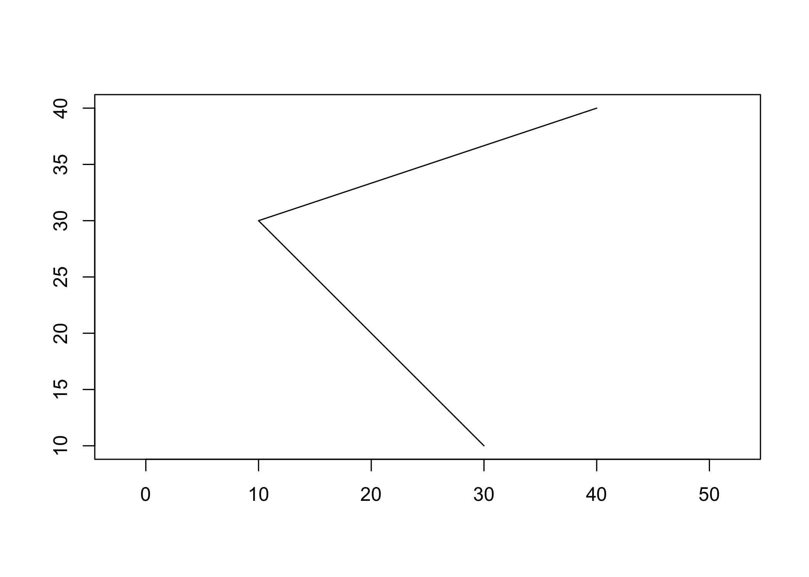

<!-- README.md is generated from README.Rmd. Please edit that file -->

# geovctrs

<!-- badges: start -->

[](https://www.tidyverse.org/lifecycle/#experimental)

[](https://codecov.io/gh/paleolimbot/geovctrs?branch=master)
<!-- badges: end -->

The goal of geovctrs is to provide a common set of classes and data
structures to ensure that processing functions in the rapidly expanding
R geospatial ecosystem are interchangeable.

## Installation

You can install the development version from
[GitHub](https://github.com/) with:

``` r
# install.packages("remotes")
remotes::install_github("paleolimbot/geovctrs")
```

You’ll have to install GEOS to build this package yourself. There will
come a day when this package won’t require GEOS, but in the words of
[Aragorn](https://en.wikipedia.org/wiki/Aragorn), that day is not this
day. On Windows this is taken care of through
[rwinlib](https://github.com/rwinlib), on MacOS you can install
[homebrew](https://brew.sh/) and run `brew install geos`, and on Linux
you can install GEOS from your favourite package manager (`apt-get
install libgeos-dev` on Debian/Ubuntu).

If you can load the package, you’re good to go\!

``` r
library(geovctrs)
```

## Geometry vectors

This package provides [vctrs](https://vctrs.r-lib.org/) class
definitions for [well-known
binary](https://en.wikipedia.org/wiki/Well-known_text_representation_of_geometry#Well-known_binary)
(`geo_wkb()`), [well-known
text](https://en.wikipedia.org/wiki/Well-known_text_representation_of_geometry)
(`geo_wkt()`), and several simple geometries that can be efficiently
stored using column vectors (`geo_xy()`, `geo_segment()`, and
`geo_rect()`). These classes are designed to work with
[dplyr](https://dplyr.tidyverse.org/),
[tidyr](https://tidyr.tidyverse.org/), and other
[tidyverse](https://tidyverse.org/) packages that use vctrs. In addition
to providing default implementations of [generics](#generics), they have
print, plot, and coercion, methods so that they “just work”.

``` r
head(geo_example_wkt)
#> <wk_wkt[6]>
#> [1] <NA>                                   
#> [2] POINT (30 10)                          
#> [3] POINT EMPTY                            
#> [4] POINT Z (1 1 5)                        
#> [5] MULTIPOINT ((10 40), (40 30), (20 20...
#> [6] MULTIPOINT EMPTY
head(as_geo_wkb(geo_example_wkt))
#> <wk_wkb[6]>
#> [1] <NA>                                     
#> [2] <POINT (30 10)>                          
#> [3] <POINT (nan nan)>                        
#> [4] <POINT Z (1 1 5)>                        
#> [5] <MULTIPOINT ((10 40), (40 30), (20 20...>
#> [6] <MULTIPOINT EMPTY>
```

## Constructing and destructing geometries

The geovctrs package provides functions to construct geometries from
coordinates, and destruct geometries to extract their coordinates.

``` r
# construct linestrings
linestrings <- c(
  geo_linestring(geo_xy(c(1, 2, 5), c(0, 1, 2))),
  geo_linestring(geo_xy(c(10, 20, 50), c(0, 10, 20)))
)

linestrings
#> <geovctrs_collection[2]>
#> [1] <LINESTRING (1 0, 2 1, 5 2)>      <LINESTRING (10 0, 20 10, 50 20)>

# destruct to get coordinates
geo_coordinates(linestrings)
#> # A tibble: 6 x 2
#>   feature xy     
#>     <int> <xy>   
#> 1       1 (1 0)  
#> 2       1 (2 1)  
#> 3       1 (5 2)  
#> 4       2 (10 0) 
#> 5       2 (20 10)
#> 6       2 (50 20)
```

You can use `separate_xy()` get the actual x and y values (and
`unite_xy()` to create a `geo_xy()` column).

``` r
separate_xy(geo_coordinates(linestrings), "xy")
#> # A tibble: 6 x 3
#>   feature     x     y
#>     <int> <dbl> <dbl>
#> 1       1     1     0
#> 2       1     2     1
#> 3       1     5     2
#> 4       2    10     0
#> 5       2    20    10
#> 6       2    50    20
```

In the [upcoming release of
dplyr](https://www.tidyverse.org/blog/2020/03/dplyr-1-0-0-summarise/),
this is useful in conjunction with `group_by()` and `summarise()`.

``` r
library(dplyr)
geo_coordinates(linestrings) %>% 
  group_by(feature) %>% 
  summarise(geometry = geo_linestring(xy))
#> # A tibble: 2 x 2
#>   feature geometry   
#> *   <int> <clctn>    
#> 1       1 / (1 0)…+2 
#> 2       2 / (10 0)…+2
```

## Generics

There are several concepts that show up on repeat in geometry packages.
The geovctrs package provides these as generics with reasonable
implementations for the bundled [geometry vector
classes](#geometry-vectors). Notably, `geo_bbox()` (returns a
`geo_rect()`), `geo_plot()` (thin wrapper around `graphics::plot()`),
and `geo_summary()` (returns a `tibble()` with basic information about
each feature). These generics work on anything that can be interpreted
as a geometry vector, including character vectors (interpreted as
well-known text), data frames with exactly one geometry column
(interpreted as the geometry column), and anything that implements
`as_geovctr()` (e.g., [sf](https://r-spatial.github.io/sf) objects).

``` r
geo_bbox(geo_nc)
#> <geovctrs_rect[1]>
#> [1] (-84.32385 33.88199↗-75.45698 36.58965)
geo_plot(geo_nc)
```



The geovctrs package also provides a framework for transformers, or
functions that accept a vector of geometries and return a vector of
geometries. These always return the same type as the input, as dictated
by the implementations of `as_geovctr()` and `restore_geovctr()`. This
enables transforming functions to work on a wide variety of input types,
including sf objects:

``` r
library(sf)
#> Linking to GEOS 3.7.2, GDAL 2.4.2, PROJ 5.2.0
sf_nc <- read_sf(system.file("shape/nc.shp", package = "sf"))
geo_envelope(sf_nc)
#> Simple feature collection with 100 features and 14 fields
#> geometry type:  POLYGON
#> dimension:      XY
#> bbox:           xmin: -84.32385 ymin: 33.88199 xmax: -75.45698 ymax: 36.58965
#> epsg (SRID):    4267
#> proj4string:    +proj=longlat +datum=NAD27 +no_defs
#> # A tibble: 100 x 15
#>     AREA PERIMETER CNTY_ CNTY_ID NAME  FIPS  FIPSNO CRESS_ID BIR74 SID74
#>    <dbl>     <dbl> <dbl>   <dbl> <chr> <chr>  <dbl>    <int> <dbl> <dbl>
#>  1 0.114      1.44  1825    1825 Ashe  37009  37009        5  1091     1
#>  2 0.061      1.23  1827    1827 Alle… 37005  37005        3   487     0
#>  3 0.143      1.63  1828    1828 Surry 37171  37171       86  3188     5
#>  4 0.07       2.97  1831    1831 Curr… 37053  37053       27   508     1
#>  5 0.153      2.21  1832    1832 Nort… 37131  37131       66  1421     9
#>  6 0.097      1.67  1833    1833 Hert… 37091  37091       46  1452     7
#>  7 0.062      1.55  1834    1834 Camd… 37029  37029       15   286     0
#>  8 0.091      1.28  1835    1835 Gates 37073  37073       37   420     0
#>  9 0.118      1.42  1836    1836 Warr… 37185  37185       93   968     4
#> 10 0.124      1.43  1837    1837 Stok… 37169  37169       85  1612     1
#> # … with 90 more rows, and 5 more variables: NWBIR74 <dbl>, BIR79 <dbl>,
#> #   SID79 <dbl>, NWBIR79 <dbl>, geometry <POLYGON [°]>
```

See `vignette("extending-geovctrs", package = "geovctrs")` for
instructions on how to create a class that works with the geovctrs
framework.
