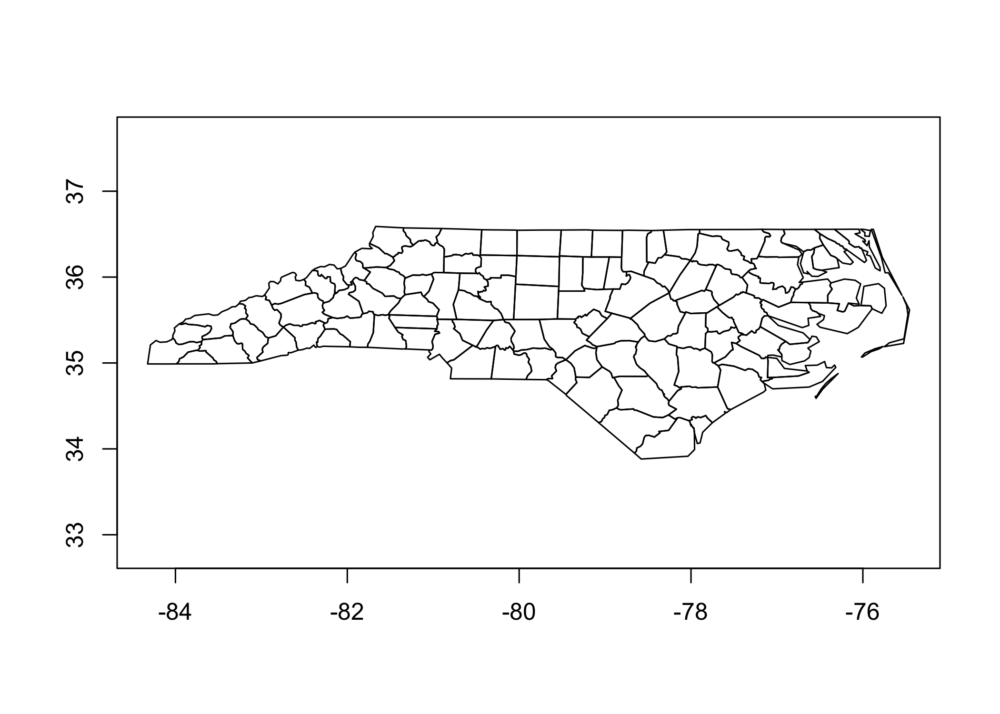

<!-- README.md is generated from README.Rmd. Please edit that file -->

# geovctrs

<!-- badges: start -->

[](https://www.tidyverse.org/lifecycle/#experimental)

[](https://codecov.io/gh/paleolimbot/geovctrs?branch=master)
<!-- badges: end -->

The goal of geovctrs is to provide a common set of classes and data
structures to ensure that processing functions in the rapidly expanding
R geospatial ecosystem are interchangable.

## Installation

You can install the development version from
[GitHub](https://github.com/) with:

``` r
# install.packages("remotes")
remotes::install_github("paleolimbot/geovctrs")
```

If you can load the package, you’re good to go\!

``` r
library(geovctrs)
```

## Example

This package has reasonable `plot()` and `print()` methods for WKB and
WKT types, and provides a [vctrs](https://vctrs.r-lib.org/)
implementation for these types so that they “just work” with
[tibble](https://tibble.tidyverse.org/),
[tidyr](https://tidyr.tidyverse.org/), and
[dplyr](https://dplyr.tidyverse.org/) (\>=1.0.0) (among others).

``` r
geo_wkt("LINESTRING (30 10, 10 30, 40 40)")
#> <geo_wkt[1]>
#> [1] LINESTRING (30 10, 10 30, 40 40)
as_geo_wkb(geo_wkt("LINESTRING (30 10, 10 30, 40 40)"))
#> <geo_wkb[1]>
#> [1] <LINESTRING>{3} (10 10...40 40)
tibble(wkt = geo_wkt("LINESTRING (30 10, 10 30, 40 40)"))
#> # A tibble: 1 x 1
#>   wkt                   
#>   <wkt>                 
#> 1 </>{3} (10 10...40 40)
```

Most methods work on anything that can be interpreted as geometry,
including character vectors and data.frames containing exactly one
geometry column.

``` r
geo_plot("LINESTRING (30 10, 10 30, 40 40)")
```



Like any self-respecting geometry package, geovctrs contains a copy of
the North Carolina dataset to play with:

``` r
rev(geo_nc)
#> # A tibble: 100 x 12
#>    geometry                                              NWBIR79 SID79
#>    <wkb>                                                   <dbl> <dbl>
#>  1 <△▽>[1]{27} (-81.74107 36.23436...-81.23989 36.58965)      19     0
#>  2 <△▽>[1]{26} (-81.34754 36.36536...-80.90344 36.57286)      12     3
#>  3 <△▽>[1]{28} (-80.96577 36.23388...-80.43531 36.56521)     260     6
#>  4 <△▽>[3]{38} (-76.33025 36.07282...-75.77316 36.55716)     145     2
#>  5 <△▽>[1]{34} (-77.90121 36.16277...-77.07531 36.55629)    1197     3
#>  6 <△▽>[1]{22} (-77.21767 36.23024...-76.70750 36.55629)    1237     5
#>  7 <△▽>[1]{24} (-76.56358 36.16973...-75.95718 36.55606)     139     2
#>  8 <△▽>[1]{17} (-76.95367 36.29452...-76.46035 36.55525)     371     2
#>  9 <△▽>[1]{14} (-78.32125 36.19595...-77.89886 36.55294)     844     2
#> 10 <△▽>[1]{6} (-80.45301 36.25023...-80.02406 36.55104)      176     5
#> # … with 90 more rows, and 9 more variables: BIR79 <dbl>, NWBIR74 <dbl>,
#> #   SID74 <dbl>, BIR74 <dbl>, CRESS_ID <int>, FIPSNO <dbl>, FIPS <chr>,
#> #   NAME <chr>, CNTY_ID <dbl>
```
